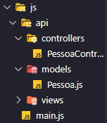

# classes = modelos ou moldes de objetos
-> formadas por atributos (características, keys, propriedades) e comportamentos (métodos/funções)

# objeto = representações do mundo real, tipo de dados, instâncias de classes.

# atributos e encapsulamento

-- visibilidade do encapsulamento 
símbolos significado 
+ public, publico(usado no js)
- private, privado(usado no js) {usamos _ para indicar que é private(convenção usado pelos devs, vc ainda pode acessar esses valores fora da classe!), # está sendo implemtentado e ainda não tem compatibilidade geral, é o mias atual e priva realmente o atributo, mas não use ainda!!!Está em aprovação}
# protected,

! se vc declarar um atributo sem nada ele por padrão é public

!CUIDADO: NO JS SE VC FIZER obj. (e colocar qualquer coisa atribuindo valor, ele adiciona aquele atributo para o obj)

# metodo constructor 
//quando vc fizer uma nova instancia  da classe pessoa, devera ser recebido como arg o parametro indicado
constructor(name, age){

}

# qando um método tem um return ele é uma function, quando não ele é um procedimento

--> método específico da classe (no ex. calcularmc())

# métodos acessores: get e set
~~~javascript
 get = pegar
 get nome(){
    return this._nome
 }
 //tem return 

 set = configurar, editar, alterar
 set nome(novoNome){
   this._nome = novoNome
 } 
~~~

 //não tem return

 # Atributo da classe(atributo estático ou static)
 -> ex.: static totalPessoas = 0; //count -> contador

 # modularizando o codigo

 ## MVC - modelo de se trabalhar com poo = aula 51
 # M - model -> no nosso exemplo: Pessoa e Lista de Pessoas (modelo, referencia)
 # V - view -> PessoaView (exibição de dados)
 # C - controller -> PessoaController (O controller sempre irá conter todas as ações, alterações e manipulações do modelo, ele é uma classe de ações)

 O modelo de organização de arqquivos e pastas de um mvc é da seguinte forma:

## Extra: Flash mensage (Mensagens rápidas)

# geralmente fazemos a definiçã/declaração dos atributos em cima e depois fazemos o get e o set, porém 
se nao declararmos e nos  referenciarmos a um ainda nao existente usando o this, o js cria o atributo por baix o dos panos

ex.:
~~~javascript
export class Mensagem {
    //o js cria isso: 
    //_texto
    
    constructor(texto = ''){
        this._texto = texto;
    }

    get texto(){
        return this._texto;
    }

    set texto(texto){
        this._texto = texto;
    }
}
~~~

## No html foram usados os atributos 'required' para definir o preenchimento do input como obrigatório, 'min' 'max' para definir os limites e 'step' para definir a formatação e o valor mais próximo aceito

# Herança, extends, super
//Em Poo, quando há repetições de códigos, o ideal é a sua abstração para uma nova entidade! Vemos a necessidade disso nas views de pessoa e mensagem na parte do constructor e do update

//Para isso iremos criar uma classe pai(ou super classe) que irá conter essas características e repassar as suas classes filhas que a herdarão.

### //'extends'  indica que uma classe é filha (estende as caractrísticas de um pai)

# quando se usa em uma classe filha um método com o mesmo nome de um método da sua classe pai
# estamos sobreescrevendo o método orignal

ex.:
~~~javascript
 update(model){//nesse caso o update permanece pois embora tenha uma parte que se repete há outra que é adicionada
        this._elemento.innerHTML = this.template(model)
        //apos 3s limpa a msg 
        setTimeout(()=> this._elemento.innerHTML = '', 3000)
    }
~~~
    o método update agora funcionará assim na minha subclasse mensagem  

## ATENÇÃO! Não é reponsabilidade do controller armazenar os dados, para isso criamos uma nova classe de repositório

- ESTUDE O PADRÃO 'REPOSITORY'(persistência de dados!) -> criar, editar, apagar (CRUD)
- VOCÊ TAMBÉM PODE ESTUDAR E MELHORAR ESSE CÓDIGO USANDO O PADRÃO 'FACTORY'
- A parte das views pode ser feita por frameworks (REACTE, VUE, ANGULAR.JS, ANGULAR, etc)
- Armazenamento de dados local e com bd(base de dados)