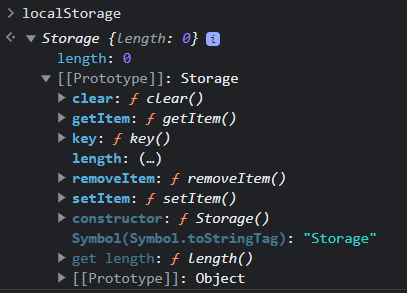
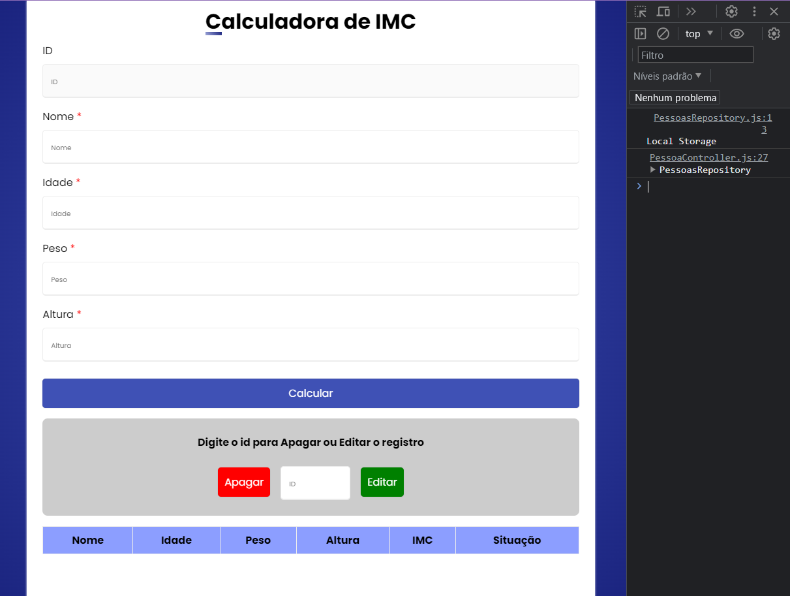

# Persistência de dados

## Local Storage => é um objeto-array do browser

~~~javascript
//Aqui faremos umna especie de 'scheme' de nossa bd
export class PessoasRepository {
    _getLocalStorage
    _setLocalStorage
    constructor(){
        //o valor que será colocado no db o acessamos por esse get
        //esse get verifica se há um item com o nome db, se tiver faz sua conversão usando o Json.parse(transforma um json em um obj), se não o retorno é uim arrray vazio
        this._getLocalStorage = () => JSON.parse(localStorage.getItem('db')) ?? [] 

        //aqui é onde realmente se cria o nosso LocalStorage de fato:
        //criamos uma base de dados que "localStrotage" que receberá ".setItem" um nome eum conteúdo "setitem("db", JSON.stringify(db)"
        this._setLocalStorage = (db) => localStorage.setItem("db", JSON.stringify(db)) //localStorage é um objeto do nosso browser
        console.log('Local Storage')
    }
}
~~~

## Um LocalStorage é um array de objetos literais do js. Logo, podemos utilizá-los para armazenar dados de forma persistente. Eles ficam armazenados no browser mesmo se a janela for fechada

# CRUD - create read update delete
### nesse projerto o Crud realizado foi feito por meio de LS! Não utilizei nenhum sgdb!

### Helpers, refatoração e modal
- modal => é basicamente uma “tela dentro da tela atual”, como se fosse uma janela por cima do conteúdo com informações adicionais, configurações e etc.
- refatoração => é basicamente reorganizar o código, deixando-o mais limpo (removendo partes desnecessárias), encapsulando funções (agrupando-as de acordo com seus usos e contextos) e reorgamizando a estrutura de arquivos.active
- helpers => janelas de ajuda/informações da aplicação

